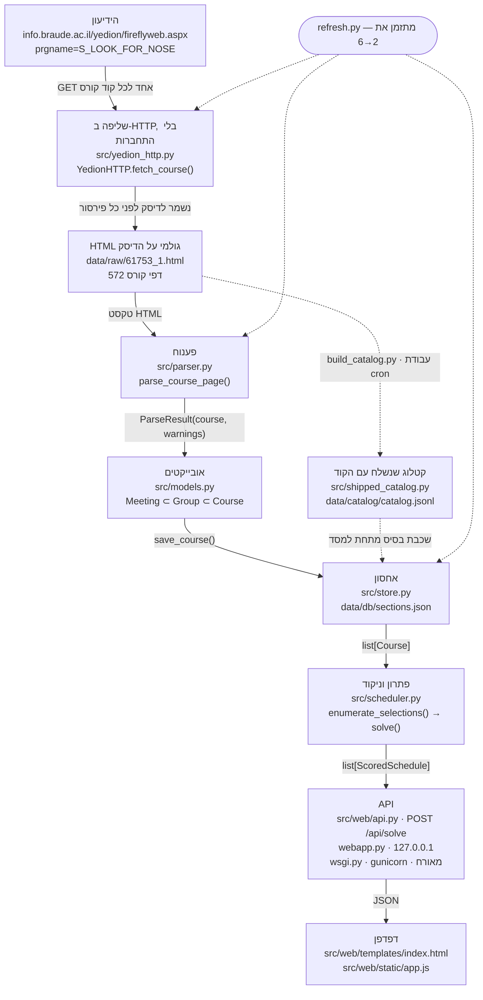

# ארכיטקטורה — SlotWise

צינור אחד, בכיוון אחד: דף HTML מהידיעון נכנס בצד אחד, מערכת שעות מדורגת
יוצאת בצד השני. כל שלב מוסר מבנה נתונים אחד לשלב הבא.

---

## הזרימה

---

## שלב אחר שלב

1. **הידיעון** — מקור האמת של המכללה. **מסך חיפוש הקורסים קריא בלי התחברות**
   (`S_LOOK_FOR_NOSE`); מוסר דף HTML אחד לכל קוד קורס.
2. **שליפה · `src/yedion_http.py`** — ספריית תקן בלבד: חימום, החלפת שנה, אימות
   שהשנה נתפסה, ואז GET לכל קוד; מוסר מחרוזת HTML.
   **שומרים את הדף לפני שמפענחים אותו — כדי שאפשר יהיה לתקן באג בפרסר ולהריץ
   מחדש בלי לגעת בשרת של המכללה.**
3. **HTML גולמי · `data/raw/`** — 572 דפי קורס (ועוד דפי פרטים, קטלוג וסשן);
   מוסר טקסט לפרסר, ומאפשר לפענח הכול מחדש בלי לגעת ברשת.
4. **פענוח · `src/parser.py`** — `parse_course_page()` מוציא מהדף קבוצות, מרצים,
   ימים, שעות, בניינים וחדרים; מוסר `ParseResult` — קורס ורשימת אזהרות.
5. **אובייקטים · `src/models.py`** — `Meeting` בתוך `Group` בתוך `Course`; מוסר
   את המבנה היחיד שכל שאר הקוד מדבר בו.
6. **אחסון · `src/store.py`** — `save_course()` / `load_all()` כותבים וקוראים את
   `data/db/sections.json`; מוסר `list[Course]`.
7. **פתרון · `src/scheduler.py`** — `enumerate_selections()` מונה בבקטרקינג כל
   בחירה חוקית, `solve()` מנקד כל אחת ושומר את הטובות; מוסר `list[ScoredSchedule]`.
8. **API · `src/web/api.py`** — Flask; `POST /api/solve` מקבל קודים והעדפות
   ומחזיר JSON. שני מפעילים: `webapp.py` לשימוש מקומי (‏`127.0.0.1` בלבד),
   ו-`wsgi.py` תחת gunicorn לאירוח.
9. **דפדפן · `index.html` + `app.js`** — HTML/CSS/JS רגילים, בלי פריימוורק ובלי
   שלב בנייה; מקבל JSON ומצייר את הגריד.

---

## שלוש החלטות

**למה זה היה מקומי, ומה השתנה.** ‏המצב של הסטודנט/ית יושב ב-`localStorage`
ולא בשרת, ולכן לא היה מה לארח; ובכיוון השני `POST /api/scrape/start` היה בלי
הזדהות ובלי מגן קצב — מאורח, הוא ממסר פתוח אל השרת של המכללה. שתי הסיבות
האלה הן שקשרו את `webapp.py` ל-`127.0.0.1` בלבד.

‏**הסיבה השנייה בוטלה ב-2026-09-16:** נקודות הקצה של הגרידה החיה הוסרו,
`wsgi.py` מקבע `allow_network=False`, ובניית הקטלוג עברה לעבודת cron נפרדת.
הראשונה עדיין נכונה ועדיין רצויה — אין חשבונות ואין מצב פר-משתמש בשרת.
‏`webapp.py` נשאר מקומי בלבד; האירוח הוא דרך `wsgi.py`. ראו `HOSTING_NOTES.md`
ו-`DEPLOY.md`.

**למה הקטלוג נשלח עם הקוד.** `data/db/` ו-`data/raw/` שניהם ב-`.gitignore`, ולכן
שכפול נקי היה עולה עם אפס קורסים; `data/catalog/catalog.jsonl` נכנס לגיט,
ו-`Store._load_sections_db()` מניח אותו כשכבת בסיס שהנתונים של המשתמש/ת דורסים.
‏הוא נבנה פעם אחת ביד; מאז ‏2026-09-16 הוא הפלט של
`.github/workflows/build-catalog.yml`.

**למה מנייה ממצה ולא היוריסטיקה.** רק מי שספר את כל הצירופים יכול לומר "אין
מערכת שעונה על הדרישות", "ארבעה ימים בלתי אפשריים, המינימום הוא חמישה" ו"אלו
באמת חמש הטובות ביותר" — היוריסטיקה מחזירה מערכת אחת סבירה ואינה יכולה להוכיח
אף אחת מהשלוש.
