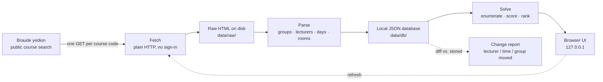

# SlotWise

**A local web app that reads Braude College's course catalogue (the *yedion*) and builds the best possible semester timetable — for any department, on your own machine, without ever seeing your password.**

<!-- TODO: screenshot of the timetable grid goes here -->



## Why it exists

Registration at Braude means opening the yedion, reading one course page at a
time, and assembling a timetable by hand. Every course has several lecture,
tutorial and lab groups, some groups are only valid together, and the things you
actually care about — *which lecturer, how many days on campus, how long the
gaps are* — are invisible until the grid is already drawn. Doing it by hand gets
you **a** timetable; it cannot tell you whether a better one existed, or that
four days on campus is impossible and five is the minimum. SlotWise enumerates
every legal combination, scores each one, shows you the best — then keeps
watching, so a lecturer or time that changes after you registered is noticed.

## How it works

1. **Fetch.** The yedion's course-search screen is readable without signing in,
   so the fetcher is plain `urllib` — one polite GET per course code, no browser
   and no credentials. Every page is written to `data/raw/` *before* it is
   parsed, so a parser fix can be re-run without touching the college's server.
2. **Parse and store.** Each page becomes `Meeting ⊂ Group ⊂ Course` in a JSON
   database under `data/db/`. Each refresh diffs against what was stored and
   reports what moved.
3. **Solve.** Backtracking enumeration walks every legal selection with pruning,
   scores each one, keeps the best. Exhaustive rather than heuristic — only a full
   count can say "no timetable satisfies this" or "these really are the top five".
4. **Show.** A Flask server bound to `127.0.0.1` serves a five-step Hebrew RTL
   interface: program and semester → courses → target days → lecturers → the
   grid. Every change re-solves immediately. Plain HTML, CSS and JS — no
   framework, no build step, no CDN.

A catalog of all **572 courses** the college opens this year ships in the repo,
so a fresh clone has data on the first run. All eight Braude degree programs are
listed, and seven also ship a parsed curriculum, so the course list for a given
semester comes pre-filled rather than typed.

## What the engine enforces

Hard constraints — these reject a combination outright:

- **No overlaps**, as a half-open interval `[start, end)`: a class ending at
  10:15 and one starting at 10:15 do not collide.
- **Linked groups.** The yedion marks "groups related to this course" — a given
  lecture requires a given tutorial. Ignoring it would produce timetables you
  cannot actually register for.
- **Tied courses.** Courses the curriculum declares inseparable are taken
  together or not at all; a missing one is a loud error, not a wrong timetable.
- **One group per component** — exactly one lecture, one tutorial, one lab.
- **Semester filter.** A course can open in both semesters and the yedion shows
  both on one page; only the requested semester's meetings are kept.
- **Your availability** — earliest start, latest finish, blocked windows, and an
  optional "no Friday".

Soft preferences only move the score:

```
score = 10.0 × preferred_lecturers      (rank 0 = 1.0, rank i = 1/(i+1), unranked = 0)
      -  8.0 × max(0, campus_days − target_days)
      -  4.0 × billable_gap_hours       (the fixed 12:20–12:50 lunch window is free)
      -  1.0 × total_day_span_hours
      -  4.0 × hours_running_past_14:00
      -  6.0 × deliberate_overlaps      (only for components you marked as no-attendance)
```

Lecturer preference is weighted by component: a lecture counts full, a tutorial
or lab 0.4 — you can compromise on a tutor to shorten a day, not on who gives the
lecture. A day holding no attendance-required component is not counted as a
campus day at all. The day target is **soft**: if four days is impossible you get
the best five-day timetable with a penalty, not a failure. If nothing is
feasible, the solver raises with a concrete explanation — which course, which
group, which day and hour collide — plus suggested relaxations.

## Quick start

```bash
# Python 3.10+
git clone https://github.com/netabaron/Schedule_Builder.git
cd Schedule_Builder
python -m pip install flask beautifulsoup4 lxml pytest
python main.py
```

That starts the local server and opens the app. There is nothing to configure —
pick a program and semester in step 1 and go. Copying `data/profile.example.json`
to `data/profile.json` pre-fills those choices, but it is optional; `playwright`
is needed only for the fallback browser fetcher and the browser tests.

The terminal flow, the scheduled refresh job and offline re-parsing are
documented in **[docs/CLI.md](docs/CLI.md)**.

## Privacy

- **The app never handles your password.** It has no username or password field
  anywhere, because the default fetch path is anonymous — the yedion's course
  search answers a plain GET. The cookie jar lives in memory and is never written
  to disk.
- **Nothing is hosted.** The server binds to `127.0.0.1` only. Your selections
  live in your browser's `localStorage`; there is no account and no backend.
- On the optional `--browser` fallback path you sign in yourself, in a real
  browser window. Even there nothing reads, asks for or stores credentials, and a
  page that is not from `info.braude.ac.il` is **never written to disk** — not as
  HTML, not as a screenshot — so an autofilled login page cannot reach
  `data/raw/`.

## Layout

```
main.py                 launcher: the browser app by default, --cli for the terminal
webapp.py               the local Flask server (127.0.0.1)
src/yedion_http.py      login-free fetcher — stdlib only, verified year protocol
src/parser.py           yedion HTML -> model; models.py = Meeting / Group / Course
src/scheduler.py        the engine: constraints, scoring, search, infeasibility diagnosis
src/store.py            JSON database: freshness, change detection, atomic writes
src/curriculum.py       curricula, prerequisites, tied courses; discovery.py = live catalog
src/web/                the JSON API and the interface (plain HTML/CSS/JS)
refresh.py              the scheduled refresh job; reparse.py re-parses saved HTML offline
data/catalog.jsonl      the shipped catalog: 572 courses, so a fresh clone has data
docs/                   CLI reference, the verified yedion protocol, the specs
tests/                  751 tests, no network
```

## Tests

```bash
python -m pytest tests/ -q     # 751 tests, none of which touch the network
```

About 20 of them drive a local Chromium to cover interface rules that live in
`app.js`; they skip themselves when no browser is installed.

## Roadmap

- **Export to `.ics` calendar** — drop the finished timetable straight into
  Google Calendar
- Exam dates in the model, so timetables can be scored on exam spacing too
- A parsed curriculum for the one remaining degree program
- Semester ב timetabling: the groups are already published, but the yedion
  carries no times for them yet
